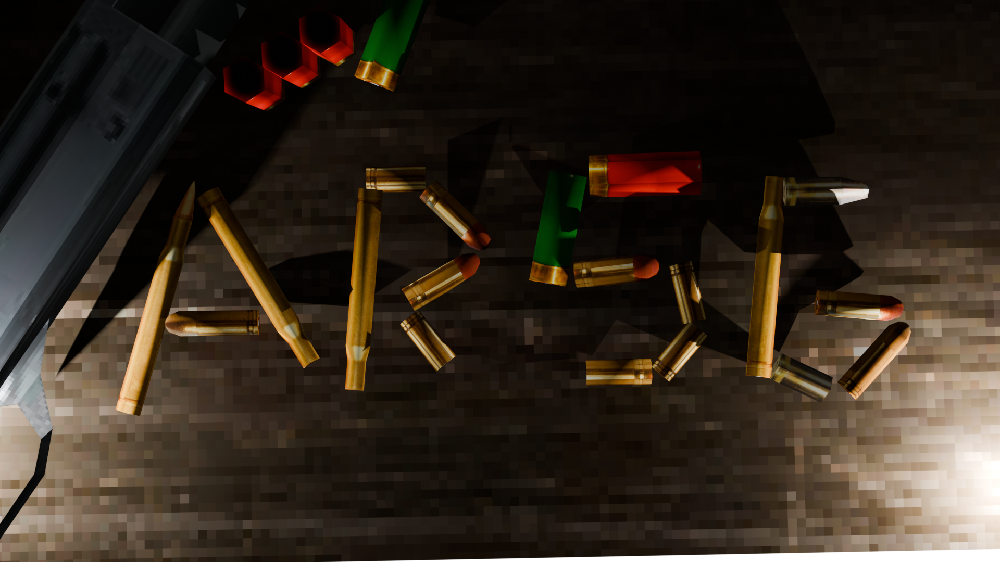
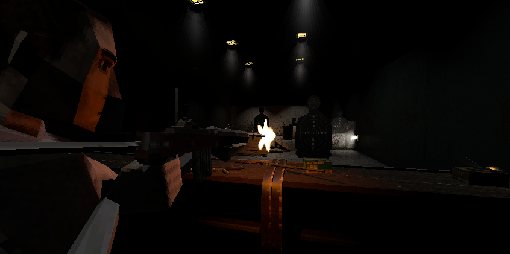
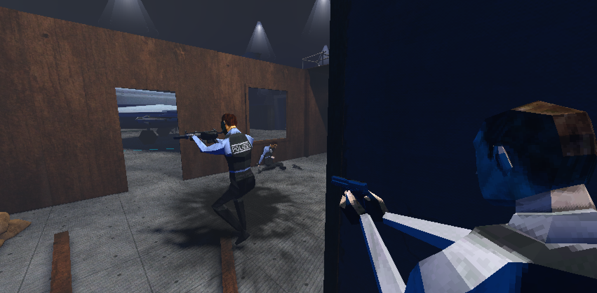
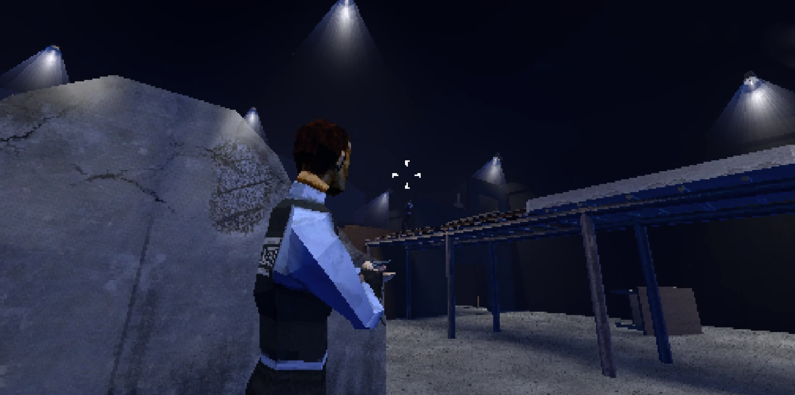
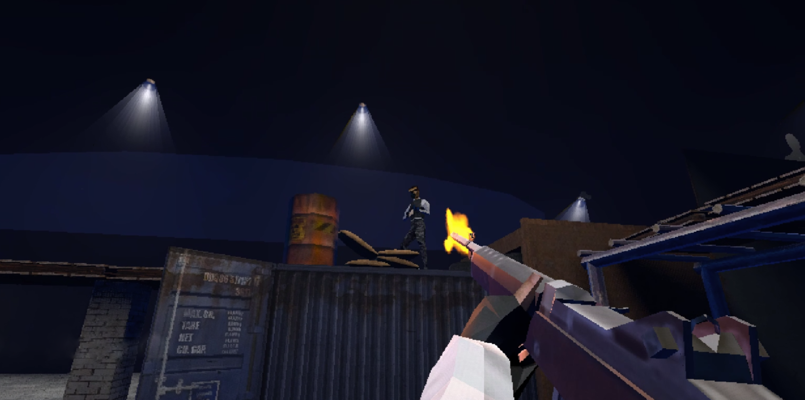
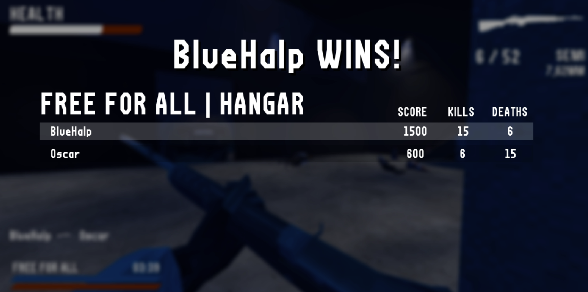

# ARSG

## What is ARSG?
ARSG is a multiplayer 1v1 FPS/TPS made in Godot with Steamworks support (thanks to GodotSteam). It started as a school project and after the 
course ended I kept developing and adding new features across a few months (it has been in development for exactly six months now), giving birth to this game. Unfortunately, at the moment 
is only a generic shooter that doesn't bring anything new to the table, but it is a good way of showcasing a first person shooter 
main components (or the skeleton of a game) and what it can be done in half a year without almost no knowledge in Godot and game networking in general. 

The game is now stable and playable, allowing people to host or join lobbies to face off against one another. That doesn't mean there are no bugs, 
I've got a few ones still waiting to be fixed, but mostly they are visual and shouldn't affect the overall experience. So, don't expect this to have 
anything you haven't seen before, but it's a game you can play with a friend or with people across the world.

To finish, I just want to say thanks to everyone who has kept me / keeps me motivated to keep doing the game and for the guy who is reading this right now (yeah, you). Just making you notice this exists is worth it.

## Features

### Steamworks compatibility
As said before, thanks to [GodotSteam](https://godotsteam.com/) I can use steamworks to facilitate the networking part. To play the game, you need to have an account and steam opened to play with other people. 

### Multiplayer
Players can face against a friend or a person in a 1v1 scenario.

### Complete control of a character
Users will be able to jump, sprint, crouch, walk, aim and shot, with a movement like the 2000 games era.

### Feedback
Thanks to animations, Inverse Kinematics and sounds you can know if a player is looking up or down, aiming, reloading, etc.

### Customizable Lobbies
You can set the privacy of the room, the time of the game, the kill limit, map, and even allow to switch perspective from a first person to third person (WIP)

### Weapons
The game features 5 weapons, each one being useful to certain situations (Shotgun, SMG, AR, Combat Rifle and a Sniper) and users can change weapon anytime they want in the match.

### Settings
You can change the graphical look of the game, lower or increase the volume and adjust the controls of the game to your liking. The changes stay even if you close the game!

### In-game chat
A person has joined your lobby and you want to tell them how happy you are to see them? You can tell him!

## What's next
The main idea was to make a game with ranks / levels system and unlockables, but I figured out that if I did that, it would have to be done locally and that would allow people to
cheat and unlock everything (can't afford a server to save all the data), so I gave it some though and came to the conclusion to make a game that doesn't has progression, but only in the match.
So, the main idea is to keep adding things to the game until it becomes a pseudo-roguelike where players get rewarded for killing sprees, the maps include bonuses and temporal buffs 
(more health, invisibility for a certain time, etc.)
Basically, the idea is to make every match completely different. This way, I can give players a different approach to the game and prevent people cheat (Outside of the lobbies).

Furthermore, things that are without saying going to be done are more maps, weapons, bullet decals, blood decals, etc. and also maybe add the armoury option (which now is disabled) to allow players create weapon classes.

Also, if you've opened the game, you have noticed the App ID is the 480 (Spacewar). This is because if anyone wants to upload a Game to Steam, you have to pay a one-time fee of 100$. I would, but I don't think my game at the moment has that worth.
In a future, if the game keeps evolving and has some worth, maybe I will be willing to do such a big step.

Maybe I'll rework how lobbies work, and replace the firing range map to be the waiting room for hosts and when another player joins, load the match itself. 
I would love to optimize the game (as I haven't touched anything related to that and I find it interesting), fix the major bugs, and keep giving updates (If I don't find a job basically).

## Known bugs / Missing features

I know there are some noticeable bugs that can affect players outside of the visual ones. The ones that are on my sight are, in order of more important to least:

- **RPC calls when joining a game sometimes fail**: I think it's a sync problem of the player who is connecting. I haven't looked at it deeply because it rarely occurs, but it can happen often if your performance is VERY, very bad.
> This bug can cause the game to be in an infinite black screen (because it's waiting for the RPC call) or take authority of a player's camera and see their POV. The only way of exiting is forcing the game to close at the moment.

- **Bullet collisions**: Maybe you feel like your bullets aren't hitting. Thats because maybe they aren't. As bullets are not raycasted, I have to constantly check for colliding bodies which sometimes cannot detect if the collision box is to small. 
> This one is serious, but playi- *testing*, I mean testing, with my friends, I've seen that it's not something very noticeable. You can notice this in the firing range map.

- **Steam invitations**: A friend can invite you and you can join the match, but it doesn't mostly work. I'll look more into it because, if I don't, then you can't make lobbies only for friends.

- **Controls mapped are not persistent (Not saving if you close the game / exit the match)**: 
 > This one is a missing feature it needs to be added. I don't find it important because the controls are the standard for a first person game and you can always change it in-game and stay like that.

- **Better respawns**: As the lobbies only allow 2 players and the map itself has a lot of spawnpoints, the chances of spawning in front of the enemy are low, but that doesn't mean it can't happen. I have to rework some 
conditions to make spawning safer for players.

- **Footsteps bugs**: Have to fix a bug where if you die in a certain moment, the footsteps sounds bug and play a lot. It happens while you're dead, when you respawn it works as normal. Another one is it seems that if you're aiming and walking, footsteps play twice.

- **Hitmarker sound**: You might have noticed that when you shot an enemy, an audio plays to indicate you're hitting the enemy, and when they hit you the same one plays. It's not a bug, but maybe I will change the sound when they hit you.

- **Ammo bug**: If you pickup a weapon, the ammo in this one restores to the default, instead of having the ammo of the previous player had in it.

- **Player Skeleton bugs**: You may sometimes notice bugs with the player skeleton. That's because GODOT has at the time (or I think it has) some limitations when trying to animate or use Inverse Kinematics with a Skeleton.
> I find it goofy and funny, but I understand people can see it as a bug. With time, I will update animations and rework the logic behind.

- **Scoreboard bug**: At the end of the match, it may occur that you don't se the other player in the list. It's not a big deal but it is still a bug.

## Images

## Credits

 - Weapon assets by [Doctor_Sci3nce](https://doctor-sci3nce.itch.io/) on Itch
 - Character model by [stephanrobertgames](https://stephrobertgames.itch.io/german-police-officer-set) on Itch
 - First person hands model by [CemCkrc](https://cemckrc.itch.io/fps-arms-psx-style) on Itch
 - Shooting range assets by [Comp-3 Interactive](https://comp3interactive.itch.io/modular-psx-shooting-range-kit) on Itch
 - PSXPack assets by [orange rice](https://orange-rice.itch.io/psxpack) on Itch
 - Additional textures (from the PSXPack): [Textures.com](https://www.textures.com/) , [Pexels.com](https://www.pexels.com/es-es/) , [FreeSound](https://freesound.org/) , [FreeStockTextures](https://freestocktextures.com/)
 - Retro FPS Kit by [Pizza Doggy](https://pizzadoggy.itch.io/modular-retro-fps-kit) on Itch
 - Weapon sounds by [oneshotofficial](https://gamebanana.com/members/1951232) on Gamebanana
 - Hitmarker sound by [Daniel SoundsGood](https://danielsoundsgood.itch.io/free-deadly-kombat-sound-effects) on Itch
 - Footsteps sounds by [Dryoma](https://dryoma.itch.io/footsteps-sounds) on Itch
 - UI sounds by [Cyrex Studios](https://cyrex-studios.itch.io/universal-ui-soundpack) on Itch
 - Pause Menu sounds by [Bleeoop](https://bleeoop.itch.io/interface-bleeps) on Itch
 - Font by [CGBotNet](https://ggbot.itch.io/fortzilla-font) on Itch
 - Light buzzing sound by [Jakob Thiesen](https://www.soundsnap.com/ambience_room_tone_fluorescent_light_buzzing_wav) on SoudSnap
 - Background war sounds by [DennisH18](https://pixabay.com/es/sound-effects/modern-war-129016/) on Pixabay
 - Muzzle flash images by [FootageCrate](https://footagecrate.com/video-effects/footagecrate-muzzleflash-5starquarter)
 
 
Some of them don't require to give attribution, but if it wasn't for them I wouldn't be able to mix everything and obtain the aesthetics I wanted for ARSG, so thanks!
